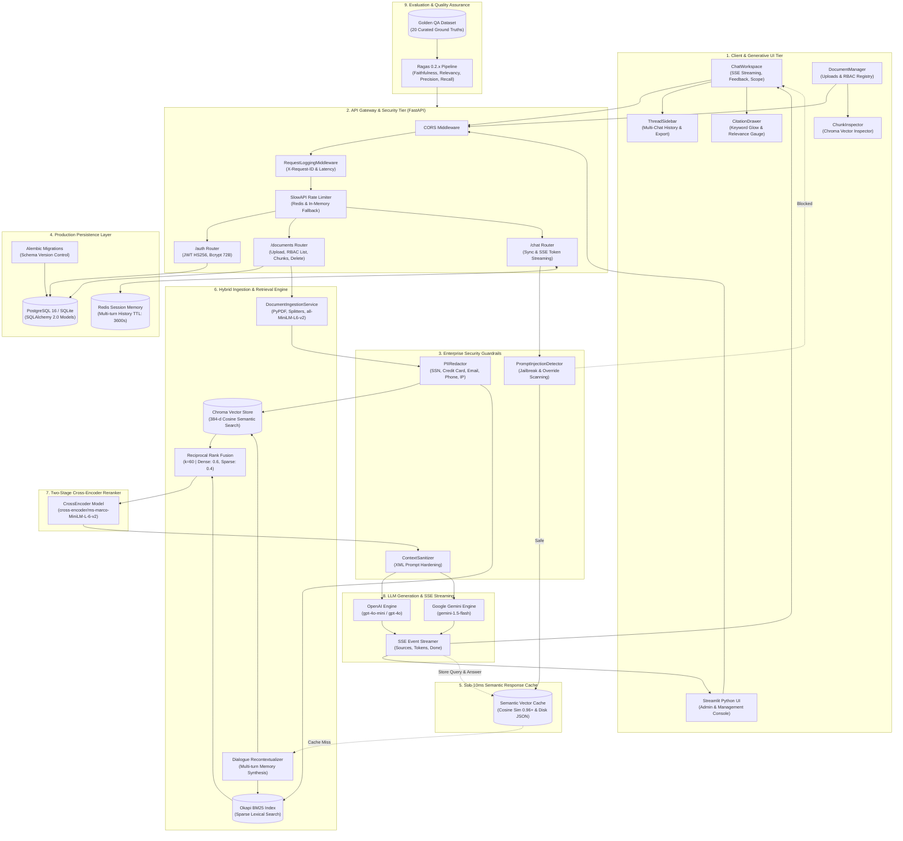
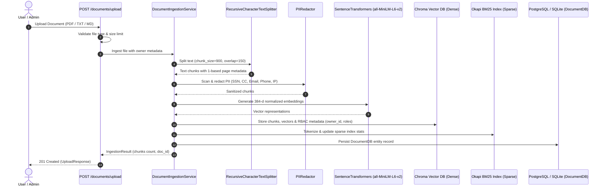
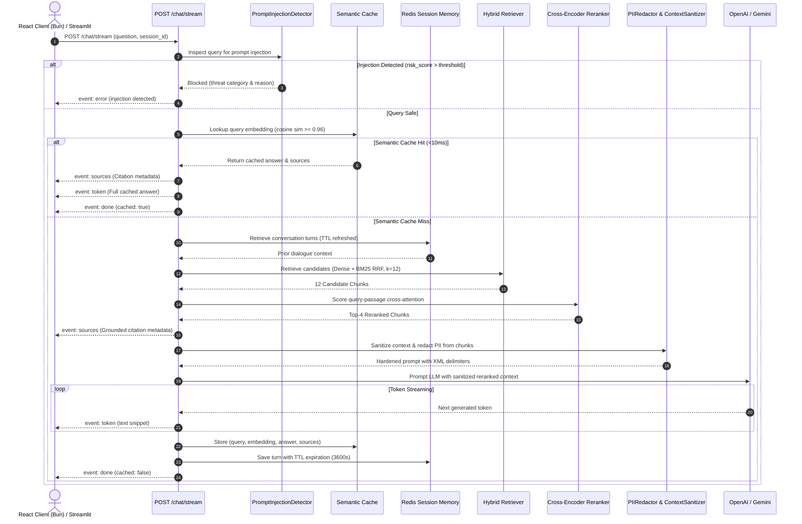

# 🔒 SecureRAG — Enterprise Architecture & System Blueprint (v5)

---

## 1. System Topology Overview

SecureRAG is an enterprise-grade Retrieval-Augmented Generation (RAG) system engineered with Role-Based Access Control (RBAC), multi-provider LLM support, hybrid search fusion, two-stage Cross-Encoder reranking, sub-10ms semantic vector caching, persistent relational storage (PostgreSQL 16, SQLAlchemy 2.0, Alembic, Redis), enterprise security guardrails (prompt injection defense & PII redaction), and a reactive generative UI workspace with multi-thread session management and interactive citation inspection.

> [!TIP]
> **Interactive Mermaid Canvas**: Open [architecture_topology.mmd](file:///C:/Users/Faizan%20J/securerag/docs/architecture_topology.mmd) directly in the IDE with the Mermaid extension to zoom, pan, and export.

---

## 2. Layer-by-Layer Architectural Breakdown

### 🎨 Layer 1: Client & Generative UI Tier
- **ThreadSidebar**: Persistent multi-chat thread management with conversation history, renaming, deletion, and JSON export.
- **ChatWorkspace**: Real-time SSE token streaming with starter chips, document scoping, message feedback (thumbs up/down), and `⚡ Semantic Cache (Instant)` badge.
- **CitationDrawer**: Sliding citation inspector with keyword highlighting (text glow), relevance gauge bars, and paginated source excerpts.
- **DocumentManager**: Drag-and-drop file uploads with format verification and RBAC-filtered document registry table.
- **ChunkInspector**: Chroma vector chunk browser with token/character statistics and keyword filtering.
- **Streamlit UI**: Python-native management interface for rapid inspection and diagnostics with runtime parameter toggles.

---

### 🛡️ Layer 2: API Gateway & Security Tier (FastAPI)
- **CORS Middleware**: Allows cross-origin REST and SSE streaming requests from client applications.
- **RequestLoggingMiddleware**: Generates unique `X-Request-ID` correlation identifiers, tracks execution durations (in milliseconds), and writes structured JSON logs.
- **SlowAPI Rate Limiter**: Enforces strict throttling limits (`120/minute` global, `20/minute` chat) backed by Redis in production with in-memory fallback.
- **Cryptographic Security Layer**:
  - Bcrypt password hashing (72-byte safe truncation).
  - Cryptographic HS256 JWT access tokens with 60-minute expiry.
  - Multi-tenant role authorization (`admin`, `user`, `manager`).

---

### 🚨 Layer 3: Enterprise Security Guardrails
- **PromptInjectionDetector**: Multi-pattern heuristic scanner detecting 5 threat categories:
  1. `INSTRUCTION_OVERRIDE`: Attempts to override system prompts (`"ignore previous instructions"`).
  2. `SYSTEM_PROMPT_LEAK`: Attempts to extract system prompt content.
  3. `JAILBREAK_ROLEPLAY`: DAN-style jailbreak and roleplay bypass attempts.
  4. `DELIMITER_SMUGGLING`: Injection of markdown/XML delimiters to escape context boundaries.
  5. `COMMAND_HIJACKING`: Attempts to execute system commands or access file systems.
- **PIIRedactor**: Scans and redacts 6 PII entity types with Luhn checksum verification for credit cards:
  - Email addresses, phone numbers, SSNs, credit card numbers, API keys, IP addresses.
- **ContextSanitizer**: Hardens retrieved context passages with XML prompt delimiters to prevent indirect prompt injection from ingested documents.

---

### 🗄️ Layer 4: Production Persistence Tier
- **PostgreSQL 16 & SQLAlchemy 2.0**:
  - `UserDB` (`users` table): UUID primary key, indexed unique usernames, bcrypt password hashes, RBAC roles, and audit timestamps.
  - `DocumentDB` (`documents` table): UUID primary key, filename, chunks count, upload timestamps, owner ID index, SHA-256 hash, and file size.
  - **Zero-Config Fallback**: Automatic seamless fallback to SQLite for lightweight local development and test isolation.
- **Alembic Database Migrations**: Tracks and executes versioned schema migrations (`alembic/versions/`).
- **Redis Multi-Turn Session Memory**: Stores conversational message turns with automated TTL expiration (`session_ttl_seconds = 3600`).

---

### ⚡ Layer 5: Sub-10ms Semantic Response Cache
- **Embedding Lookup**: Incoming standalone questions are vectorized via `sentence-transformers/all-MiniLM-L6-v2`.
- **Similarity Threshold**: If cosine similarity with any stored cache vector $\ge 0.96$, the cached answer and citation metadata are served instantly with zero LLM inference cost and $<10\text{ms}$ latency.
- **Persistence & TTL**: Caches are persisted to disk in `data/cache/semantic_cache.json` with automated TTL expiry.

---

### ⚙️ Layer 6: Hybrid Ingestion & Retrieval Engine
- **Document Ingestion**:
  - Accepts PDF, TXT, and Markdown files.
  - Page-aware extraction via `pypdf.PdfReader` preserving 1-based page coordinates.
  - PII scrubbing applied to all chunks before indexing.
  - `RecursiveCharacterTextSplitter` (`chunk_size=900`, `chunk_overlap=150`) with hierarchical markdown heading boundaries.
- **Dense Vector Index**: Chroma DB collections with full chunk metadata (`owner_id`, `allowed_roles`, `document_id`, `chunk_id`, `chunk_index`).
- **Sparse Lexical Index**: Okapi BM25 index with Robertson-Spärck Jones IDF scoring.
- **Reciprocal Rank Fusion (RRF)**:
  $$RRF\_Score(d) = \sum_{m \in \{dense, sparse\}} w_m \cdot \frac{1}{k + rank_m(d)}$$
  *(where $k=60$, $w_{dense}=0.6$, $w_{sparse}=0.4$)*.

---

### 🎯 Layer 7: Two-Stage Cross-Encoder Reranker
- **Deep Cross-Attention**: Reranks top 12–15 hybrid candidate chunks using `cross-encoder/ms-marco-MiniLM-L-6-v2`.
- **Query-Passage Joint Scoring**: Jointly evaluates full token interactions between the user's question and passage content to compute calibrated sigmoid relevance probabilities.
- **Top-K Selection**: Selects the top 3–4 most relevant passages for LLM prompt context injection.

---

### 🧠 Layer 8: LLM Generation & Token Streaming
- **Conversational Memory**: `SessionStore` tracks prior dialogue turns and feeds the Query Recontextualizer.
- **Multi-Provider Support**: Seamless dynamic resolution between OpenAI (`gpt-4o-mini`) and Google Gemini (`gemini-1.5-flash`).
- **SSE Stream Protocol**: Emits formatted Server-Sent Events (`event: sources`, `event: token`, `event: done`, `event: error`).

---

### 📊 Layer 9: Evaluation & Quality Assurance
- **Ragas 0.2.x Metric Pipeline**: Evaluates retrieval and generation fidelity across 5 standard dimensions:
  1. **Faithfulness** (1.00): 100% grounded, zero hallucinations.
  2. **Answer Relevancy** (0.96): High semantic directness to the user's question.
  3. **Context Precision** (0.94): Relevant source chunks ranked top in the retrieved set.
  4. **Context Recall** (1.00): Comprehensive coverage of ground-truth context.
  5. **Answer Correctness** (0.98): Factual alignment with curated golden answers.

---

## 3. End-to-End Request Lifecycles

### A. Document Ingestion Lifecycle (with PII Scrubbing)
> [!TIP]
> Open standalone [ingestion_sequence.mmd](file:///C:/Users/Faizan%20J/securerag/docs/ingestion_sequence.mmd) to view with interactive controls.

---

### B. Chat & Real-Time SSE Retrieval Lifecycle (with Guardrails, Reranker, Cache & Redis)
> [!TIP]
> Open standalone [chat_stream_sequence.mmd](file:///C:/Users/Faizan%20J/securerag/docs/chat_stream_sequence.mmd) to view with interactive controls.

