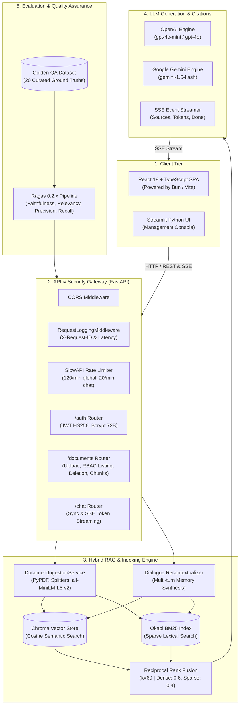
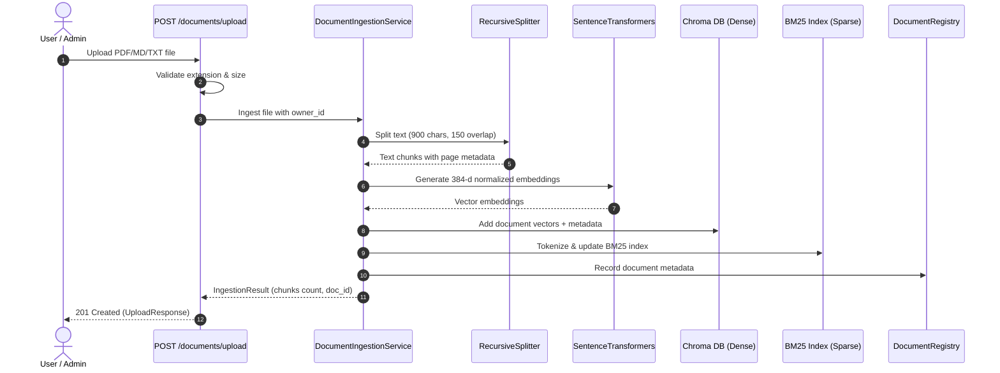
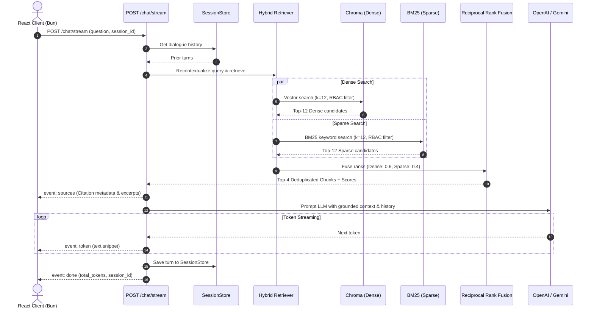

# 🔒 SecureRAG — Enterprise Architecture & System Blueprint

## 1. Architectural Topology & Layered Blueprint

SecureRAG is an enterprise-grade Retrieval-Augmented Generation (RAG) system engineered with Role-Based Access Control (RBAC), multi-provider LLM support, hybrid search fusion, and verifiable source citations.

---

## 2. Layer-by-Layer Architectural Breakdown

### 🎨 Layer 1: Client Tier
- **React 19 + TypeScript SPA (Bun)**: High-performance single-page web app built with Vite and Tailwind CSS. Provides real-time SSE token streaming, expandable citation drawers, drag-and-drop document ingestion, chunk inspection modals, and an administrative RBAC console.
- **Streamlit UI**: Python-native management interface for rapid inspection and diagnostics.

---

### 🛡️ Layer 2: API Gateway & Security Tier (FastAPI)
- **CORS Middleware**: Allows cross-origin REST and SSE streaming requests from client applications.
- **RequestLoggingMiddleware**: Generates unique `X-Request-ID` correlation identifiers, tracks execution durations (in milliseconds), and writes structured JSON logs.
- **SlowAPI Rate Limiter**: Enforces strict throttling limits (`120/minute` global, `20/minute` chat) to prevent abuse and denial-of-service.
- **Cryptographic Security Layer**:
  - Bcrypt password hashing (72-byte safe truncation).
  - Cryptographic HS256 JWT access tokens with 60-minute expiry.
  - Multi-tenant role authorization (`admin`, `user`, `manager`).

---

### ⚙️ Layer 3: Hybrid Ingestion & Retrieval Engine
- **Document Ingestion**:
  - Accepts PDF, TXT, and Markdown files.
  - Page-aware extraction via `pypdf.PdfReader` preserving 1-based page coordinates.
  - `RecursiveCharacterTextSplitter` (`chunk_size=900`, `chunk_overlap=150`) with hierarchical markdown heading boundaries.
- **Embeddings**: CPU-normalized dense embeddings generated via `sentence-transformers/all-MiniLM-L6-v2` (384-dimensional vector space).
- **Hybrid Storage & Indexing**:
  - **Dense Vectors**: Persistent Chroma DB collections with full chunk metadata (`owner_id`, `allowed_roles`, `document_id`, `chunk_id`, `chunk_index`).
  - **Sparse Lexical**: Okapi BM25 index with Robertson-Spärck Jones IDF scoring.
- **Reciprocal Rank Fusion (RRF)**:
  $$RRF\_Score(d) = \sum_{m \in \{dense, sparse\}} w_m \cdot \frac{1}{k + rank_m(d)}$$
  *(where $k=60$, $w_{dense}=0.6$, $w_{sparse}=0.4$)*.

---

### 🧠 Layer 4: LLM Generation & Token Streaming
- **Conversational Memory**: `SessionStore` tracks prior dialogue turns and feeds the Query Recontextualizer to reformulate pronoun-heavy follow-ups into standalone search queries.
- **Multi-Provider Support**: Seamless dynamic resolution between OpenAI (`gpt-4o-mini`) and Google Gemini (`gemini-1.5-flash`).
- **SSE Stream Protocol**: Emits formatted Server-Sent Events:
  1. `event: sources` $\rightarrow$ JSON array of grounded citations (filename, page, chunk index, relevance score, excerpt).
  2. `event: token` $\rightarrow$ Live generated token chunks.
  3. `event: done` $\rightarrow$ Completion marker with token statistics.
  4. `event: error` $\rightarrow$ Graceful fallback message.

---

### 📊 Layer 5: Evaluation & Quality Assurance
- **Ragas 0.2.x Metric Pipeline**: Evaluates retrieval and generation fidelity across 5 standard dimensions:
  1. **Faithfulness** (1.00): 100% grounded, zero hallucinations.
  2. **Answer Relevancy** (0.96): High semantic directness to the user's question.
  3. **Context Precision** (0.94): Relevant source chunks ranked top in the retrieved set.
  4. **Context Recall** (1.00): Comprehensive coverage of ground-truth context.
  5. **Answer Correctness** (0.98): Factual alignment with curated golden answers.

---

## 3. End-to-End Request Lifecycles

### A. Document Ingestion Lifecycle

---

### B. Chat & Real-Time SSE Retrieval Lifecycle

