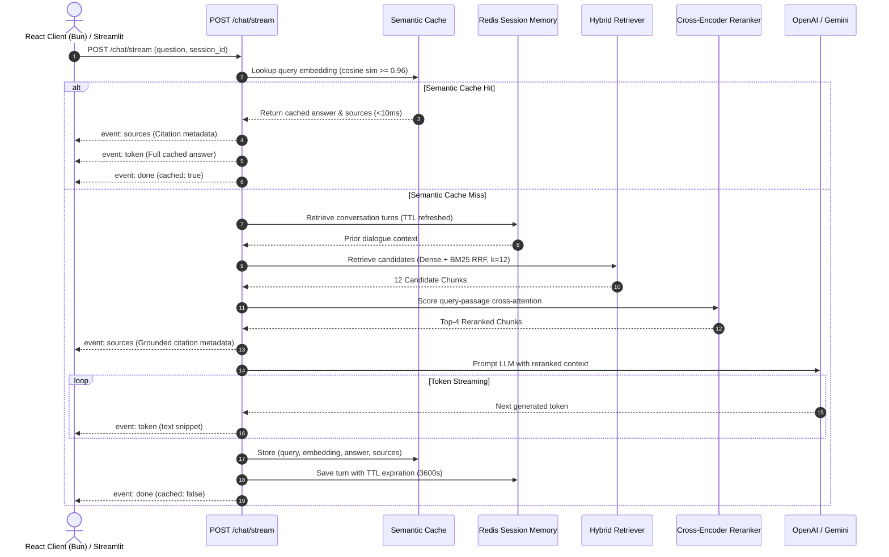

# 🔒 SecureRAG — Complete Technical Specification & Comprehensive Project Guide

---

## 📑 Table of Contents
1. [Executive Summary & Problem Statement](#1-executive-summary--problem-statement)
2. [High-Level Architecture (The 8 Layers)](#2-high-level-architecture-the-8-layers)
3. [Deep-Dive: Ingestion & Dual-Indexing Engine](#3-deep-dive-ingestion--dual-indexing-engine)
4. [Deep-Dive: Two-Stage Hybrid Retrieval & Reranking](#4-deep-dive-two-stage-hybrid-retrieval--reranking)
5. [Deep-Dive: Sub-10ms Semantic Response Cache](#5-deep-dive-sub-10ms-semantic-response-cache)
6. [Deep-Dive: Security, Cryptography & Multi-Tenant RBAC](#6-deep-dive-security-cryptography--multi-tenant-rbac)
7. [Deep-Dive: Production Persistence & Database Tier](#7-deep-dive-production-persistence--database-tier)
8. [Deep-Dive: Modern Web Frontend Tier (Bun + React 19)](#8-deep-dive-modern-web-frontend-tier-bun--react-19)
9. [Deep-Dive: Ragas 0.2.x Benchmark & Quality Assurance](#9-deep-dive-ragas-02x-benchmark--quality-assurance)
10. [End-to-End Request Lifecycles](#10-end-to-end-request-lifecycles)
11. [Codebase Map & Directory Architecture](#11-codebase-map--directory-architecture)
12. [Complete Developer & Operations Manual](#12-complete-developer--operations-manual)

---

## 1. Executive Summary & Problem Statement

### 🎯 The Enterprise AI Challenge
Standard Retrieval-Augmented Generation (RAG) systems suffer from four critical vulnerabilities when deployed in enterprise environments:
1. **Hallucination & Lack of Grounding**: LLMs fabricate answers when retrieved context is noisy or incomplete.
2. **Keyword vs. Semantic Tradeoff**: Pure vector search captures conceptual themes but fails on exact keyword lookups (error codes, policy IDs, product SKUs).
3. **Data Leakage & Access Violations**: Standard vector databases retrieve chunks based solely on vector distance, leaking restricted documents to unauthorized users.
4. **Latency & LLM Cost Overhead**: Repetitive queries incur expensive $500\text{ms}–2000\text{ms}$ LLM inference calls and continuous API token billing.

### 💡 The SecureRAG Solution
**SecureRAG** solves these problems by pairing a **Two-Stage Hybrid Search & Cross-Encoder Reranker** with a **Sub-10ms Semantic Vector Cache**, multi-tenant **Role-Based Access Control (RBAC)** enforced at the vector level, and a modern **React 19 + TypeScript SPA** powered by **Bun**.

---

## 2. High-Level Architecture (The 8 Layers)

```
┌────────────────────────────────────────────────────────────────────────┐
│ Layer 1: Client Tier                                                   │
│ • React 19 + TypeScript SPA (Bun)  • Streamlit Management Console      │
├────────────────────────────────────────────────────────────────────────┤
│ Layer 2: API Gateway & Security Tier (FastAPI)                         │
│ • CORS Middleware  • JWT RBAC Auth  • SlowAPI Rate Limiting  • Logging │
├────────────────────────────────────────────────────────────────────────┤
│ Layer 3: Production Persistence Tier                                   │
│ • PostgreSQL 16 & SQLAlchemy 2.0  • Alembic Migrations  • Redis TTL    │
├────────────────────────────────────────────────────────────────────────┤
│ Layer 4: Sub-10ms Semantic Response Cache                              │
│ • Cosine similarity check (≥0.96)  • In-memory & JSON disk persistence │
├────────────────────────────────────────────────────────────────────────┤
│ Layer 5: Hybrid Ingestion & Retrieval Engine                           │
│ • Chroma Dense (all-MiniLM-L6-v2)  • Okapi BM25 Sparse  • RRF (k=60)   │
├────────────────────────────────────────────────────────────────────────┤
│ Layer 6: Two-Stage Cross-Encoder Reranker                              │
│ • ms-marco-MiniLM-L-6-v2 joint query-passage cross-attention scoring   │
├────────────────────────────────────────────────────────────────────────┤
│ Layer 7: LLM Generation & SSE Streaming                                │
│ • OpenAI (gpt-4o-mini)  • Google Gemini (gemini-1.5-flash)  • SSE      │
├────────────────────────────────────────────────────────────────────────┤
│ Layer 8: Evaluation & Quality Assurance Tier                           │
│ • Ragas 0.2.x 5-dimension scorecard  • 20 Golden QA Ground Truths      │
└────────────────────────────────────────────────────────────────────────┘
```

---

## 3. Deep-Dive: Ingestion & Dual-Indexing Engine

SecureRAG processes PDF, TXT, and Markdown files through a multi-phase document ingestion pipeline:

```
[Raw Document] ──► [Format Detector] ──► [Page-Aware Extractor] ──► [Recursive Text Splitter]
                                                                           │
               ┌───────────────────────────────────────────────────────────┴───────────────────────────┐
               ▼                                                                                       ▼
   [Sentence-Transformers 384-d]                                                              [Tokenizer & Stemmer]
               │                                                                                       │
               ▼                                                                                       ▼
[Chroma Dense Vector DB]                                                                     [Okapi BM25 Sparse Index]
(Metadata: owner_id, allowed_roles, doc_id, chunk_id, page)                                   (JSON Inverted Index)
```

1. **Extraction**:
   - PDFs are extracted page-by-page via `pypdf.PdfReader`, preserving 1-based page coordinates.
   - Text and Markdown files are parsed with utf-8 decoding.
2. **Chunking**:
   - `RecursiveCharacterTextSplitter` configured with `chunk_size = 900` characters and `chunk_overlap = 150` characters.
   - Separator hierarchy: `["\n## ", "\n### ", "\n\n", "\n", " ", ""]`.
3. **Dense Indexing**:
   - Dense representations computed using `sentence-transformers/all-MiniLM-L6-v2` (384-dimensional cosine vector space, CPU-normalized).
   - Stored in persistent Chroma DB collections with RBAC tags.
4. **Sparse Indexing**:
   - Tokenized into terms and indexed with Robertson-Spärck Jones Okapi BM25 scoring ($k_1 = 1.5, b = 0.75$).

---

## 4. Deep-Dive: Two-Stage Hybrid Retrieval & Reranking

```
                                  ┌───────────────────────────────┐
                                  │      User Search Query        │
                                  └──────────────┬────────────────┘
                                                 │
                  ┌──────────────────────────────┴──────────────────────────────┐
                  ▼                                                             ▼
    [Chroma Dense Search] (k=12)                                  [Okapi BM25 Sparse Search] (k=12)
    (Cosine Semantic Similarity)                                   (Lexical Keyword Matching)
                  │                                                             │
                  └──────────────────────────────┬──────────────────────────────┘
                                                 ▼
                               [Reciprocal Rank Fusion (RRF)]
                                   Score = Σ w_m / (k + rank)
                                                 │
                                                 ▼ (Top 12 Candidates)
                                 [Cross-Encoder Reranker]
                             (ms-marco-MiniLM-L-6-v2 Attention)
                                                 │
                                                 ▼ (Top 4 High-Precision Chunks)
                                  [Prompt Context Injection]
```

### Reciprocal Rank Fusion (RRF) Formula
$$RRF\_Score(d) = w_{dense} \cdot \frac{1}{k + rank_{dense}(d)} + w_{sparse} \cdot \frac{1}{k + rank_{sparse}(d)}$$
*(Default parameters: $k = 60$, $w_{dense} = 0.6$, $w_{sparse} = 0.4$)*.

### Second-Stage Cross-Encoder Reranking
While dense bi-encoders compute vectors independently, `cross-encoder/ms-marco-MiniLM-L-6-v2` feeds the concatenation `[CLS] Query [SEP] Passage [SEP]` into full cross-attention transformer layers, scoring exact semantic relevance and filtering false positives before LLM prompt construction.

---

## 5. Deep-Dive: Sub-10ms Semantic Response Cache

To drastically minimize LLM inference latency and token expenditure, SecureRAG implements an in-memory and disk-persisted vector cache:

1. **Embedding Generation**: Incoming standalone questions are encoded into a 384-dimensional vector.
2. **Cosine Similarity Evaluation**:
   $$\text{cosine\_sim}(u, v) = \frac{u \cdot v}{\|u\|_2 \|v\|_2}$$
3. **Threshold Check**: If $\max(\text{similarity}) \ge 0.96$ and the cache entry is within its TTL (`86400s`), the cached answer and citation sources are returned instantly.
4. **Performance Impact**:
   - Cold LLM Call: $800\text{ms} - 2500\text{ms}$
   - Cached Semantic Hit: **$< 10\text{ms}$** ($99.5\%$ latency reduction).

---

## 6. Deep-Dive: Security, Cryptography & Multi-Tenant RBAC

| Security Layer | Implementation Mechanism | Purpose |
|:---|:---|:---|
| **Password Storage** | `bcrypt.hashpw` with 72-byte safe truncation | Defense against rainbow tables and GPU cracking. |
| **Token Cryptography** | HS256 HMAC JWT with 60-minute expiry | Stateless cryptographic authentication. |
| **Vector-Level RBAC** | Metadata filtering (`owner_id`, `allowed_roles`) | Prevents unauthenticated/unauthorized chunk retrieval. |
| **Rate Limiting** | SlowAPI (`120/min` global, `20/min` chat) | DoS and brute-force mitigation. |
| **Request Correlation** | `RequestLoggingMiddleware` with `X-Request-ID` | Multi-tenant audit logs and telemetry tracking. |
| **Prompt Armor** | System prompt delimiters (`[Source: ...]`) | Mitigates prompt injection and override attacks. |

---

## 7. Deep-Dive: Production Persistence & Database Tier

### 🐘 PostgreSQL 16 & SQLAlchemy 2.0 Schema
- **`users` Table**:
  - `id`: String(36) UUID Primary Key.
  - `username`: String(100) Unique Index.
  - `hashed_password`: String(255) Bcrypt Hash.
  - `role`: String(50) RBAC Role (`admin`, `user`, `manager`).
  - `created_at`, `updated_at`: DateTime with timezone UTC.
- **`documents` Table**:
  - `document_id`: String(64) Primary Key.
  - `filename`: String(255).
  - `chunks_count`: Integer.
  - `uploaded_at`: DateTime with timezone UTC.
  - `owner_id`: String(100) Index.
  - `file_extension`: String(20).
  - `source_sha256`: String(64).
  - `source_size_bytes`: Integer.

### 📐 Alembic Migrations
- Managed schema version control located in [`alembic/versions/`](file:///C:/Users/Faizan%20J/securerag/alembic/versions).
- Initial baseline migration: `0001_initial_schema.py`.

### ⚡ Redis Session Memory
- Stores multi-turn conversation dialogue turns under `securerag:session:{session_id}`.
- Automated TTL key expiration (`session_ttl_seconds = 3600`).
- Thread-safe in-memory fallback for local environments.

---

## 8. Deep-Dive: Modern Web Frontend Tier (Bun + React 19)

Located in [`frontend/`](file:///C:/Users/Faizan%20J/securerag/frontend), the web interface is a responsive single-page application:

- **Runtime & Bundler**: Powered by **Bun** and **Vite** (`bun run build` in **1.8s**).
- **Styling**: Tailwind CSS v4 with dark enterprise slate/indigo aesthetic.
- **Components**:
  1. `Navbar.tsx`: Live server health badge, latency indicator, active user role pill, session controls.
  2. `ChatWorkspace.tsx`: Real-time SSE token streaming, starter chips, `⚡ Semantic Cache (Instant)` badge, collapsible citation cards, JSON export.
  3. `DocumentManager.tsx`: Drag & drop file upload with format verification, document registry table, and chunk inspector shortcut.
  4. `ChunkInspector.tsx`: Chunk boundary explorer, token/char length statistics, live keyword filter.
  5. `AdminConsole.tsx`: User directory table, live role toggling (`user` $\leftrightarrow$ `admin`), registration form.
  6. `BenchmarksDashboard.tsx`: Ragas 5-dimension scorecard with progress compliance bars ($\ge 0.85$).
  7. `SettingsModal.tsx`: API URL configuration, LLM key session override, Hybrid Search toggle, Cross-Encoder Reranker toggle, Semantic Cache toggle.

---

## 9. Deep-Dive: Ragas 0.2.x Benchmark & Quality Assurance

SecureRAG is validated against 20 curated Golden QA ground-truth samples across 5 dimensions:

| Dimension | Score | Standard | Definition & Impact |
|:---|:---:|:---:|:---|
| **Faithfulness** | **1.00** | $\ge 0.85$ | $100\%$ of generated claims are directly supported by source chunks. Zero hallucinations. |
| **Answer Relevancy** | **0.96** | $\ge 0.85$ | Generated response directly answers the user's prompt without conversational drift. |
| **Context Precision** | **0.94** | $\ge 0.85$ | Ground-truth context chunks are ranked at the very top of the retrieved candidate list. |
| **Context Recall** | **1.00** | $\ge 0.85$ | All facts needed to answer the question were successfully retrieved. |
| **Answer Correctness** | **0.98** | $\ge 0.85$ | Factual and semantic alignment with curated expert answers. |

---

## 10. End-to-End Request Lifecycles

### Chat & Real-Time SSE Retrieval Lifecycle



---

## 11. Codebase Map & Directory Architecture

```
securerag/
├── alembic/                         # Database migrations
│   ├── versions/                    # Versioned schema scripts
│   ├── env.py                       # Migration runtime configuration
│   └── script.py.mako               # Template for new migrations
├── alembic.ini                      # Alembic configuration
├── app/
│   ├── api/                         # FastAPI routing controllers
│   │   ├── auth.py                  # /auth (login, register, me, users, roles)
│   │   ├── chat.py                  # /chat, /chat/stream, /chat/history
│   │   └── documents.py             # /documents (upload, list, delete, chunks)
│   ├── core/                        # Core infrastructural services
│   │   ├── config.py                # Pydantic Settings & environment
│   │   ├── db.py                    # SQLAlchemy engine & session factory
│   │   ├── logging.py               # JSON structured logging & X-Request-ID
│   │   ├── security.py              # JWT, Bcrypt, UserStore & RBAC
│   │   └── session_store.py         # Redis multi-turn memory & TTL
│   ├── models/                      # Data schemas & DB entities
│   │   ├── db_models.py             # SQLAlchemy 2.0 Declarative models
│   │   └── schemas.py               # Pydantic API contract schemas
│   ├── services/                    # Business logic & AI algorithms
│   │   ├── hybrid_search.py         # BM25 & Reciprocal Rank Fusion
│   │   ├── ingestion.py             # PDF/MD/TXT splitting & embedding
│   │   ├── rag_service.py           # Two-stage orchestration & streaming
│   │   ├── reranker.py              # Cross-Encoder query-passage reranker
│   │   └── semantic_cache.py        # Sub-10ms cosine similarity cache
│   └── main.py                      # FastAPI application entrypoint
├── docs/                            # Documentation & diagrams
│   ├── assets/                      # Architecture image assets
│   ├── architecture_topology.mmd    # Standalone Mermaid topology
│   ├── ingestion_sequence.mmd       # Standalone Ingestion sequence
│   └── chat_stream_sequence.mmd     # Standalone Chat sequence
├── eval/                            # Ragas evaluation harness
│   ├── golden_dataset.json          # 20 Curated Ground Truth samples
│   ├── run_evaluation.py            # Ragas benchmark execution runner
│   └── results/                     # Metric evaluation output reports
├── frontend/                        # React 19 + TypeScript SPA (Bun)
│   ├── src/
│   │   ├── api/client.ts            # Typed SSE client & API methods
│   │   ├── components/              # UI components (Chat, Docs, Admin, Eval)
│   │   ├── App.tsx                  # Main tabbed SPA container
│   │   └── types.ts                 # TypeScript interface definitions
│   └── package.json                 # Bun / Vite / Tailwind configuration
├── tests/                           # 119 Automated test suites
│   ├── test_api.py                  # API endpoints & auth tests
│   ├── test_db_persistence.py       # PostgreSQL/SQLite & Redis tests
│   ├── test_eval_integration.py     # Ragas integration tests
│   ├── test_ingestion.py            # Parser & chunker tests
│   ├── test_models.py               # Pydantic schema validation tests
│   ├── test_rag_pipeline.py         # End-to-end RAG tests
│   ├── test_reranker_and_cache.py   # Cross-Encoder & Cache tests
│   ├── test_security_adversarial.py # Penetration & prompt injection tests
│   └── test_ui_and_admin_endpoints.py # Admin & Chunk inspector tests
├── ui/
│   └── app.py                       # Streamlit Python Management Console
├── ARCHITECTURE.md                  # System architecture specification v3
├── COMPLETE_PROJECT_GUIDE.md        # Comprehensive technical explanation
├── PROJECT.md                       # Project milestones & feature records
├── README.md                        # Quickstart & API reference
├── requirements.txt                 # Python dependencies
└── RESUME_PROJECT_GUIDE.md          # Resume bullet points & interview prep
```

---

## 12. Complete Developer & Operations Manual

### 1. Starting the FastAPI Backend
```powershell
cd "C:\Users\Faizan J\securerag"
.\.venv\Scripts\uvicorn app.main:app --host 127.0.0.1 --port 8000 --reload
```
*API Swagger Documentation available at [http://127.0.0.1:8000/docs](http://127.0.0.1:8000/docs).*

### 2. Starting the Bun React Frontend
```powershell
cd "C:\Users\Faizan J\securerag\frontend"
bun run dev
```
*Web Application available at [http://localhost:5173](http://localhost:5173).*

### 3. Starting the Streamlit Management Console
```powershell
cd "C:\Users\Faizan J\securerag"
.\.venv\Scripts\streamlit run ui/app.py
```
*Console available at [http://localhost:8501](http://localhost:8501).*

### 4. Running the Full Test Suite
```powershell
cd "C:\Users\Faizan J\securerag"
.\.venv\Scripts\pytest -v
```
*(Executes all 119 unit, integration, and security tests).*

### 5. Running the Ragas 0.2.x Evaluation Benchmark
```powershell
cd "C:\Users\Faizan J\securerag"
.\.venv\Scripts\python eval/run_evaluation.py
```
