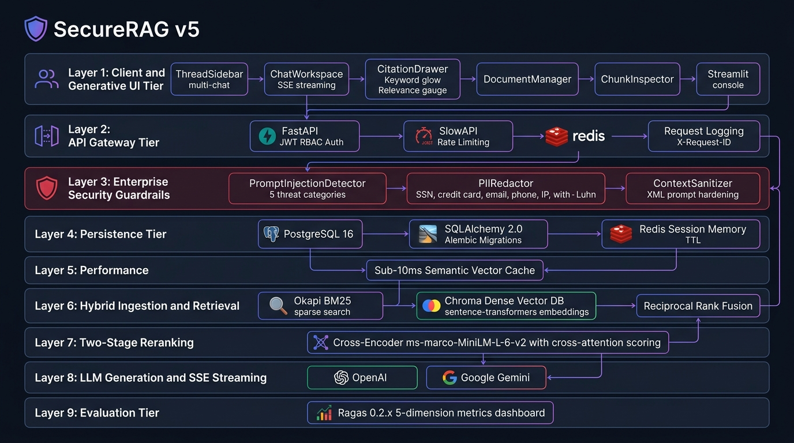
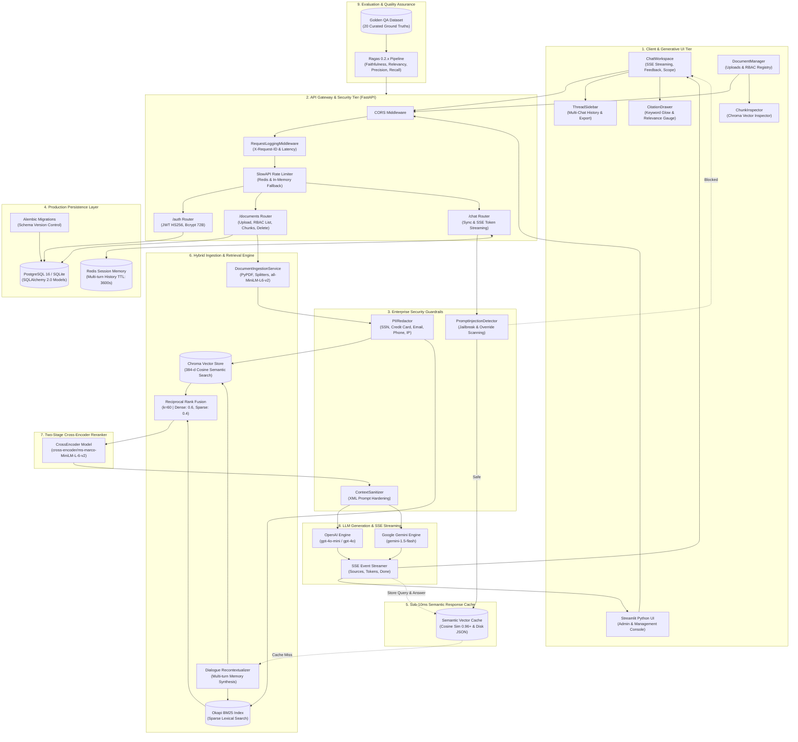
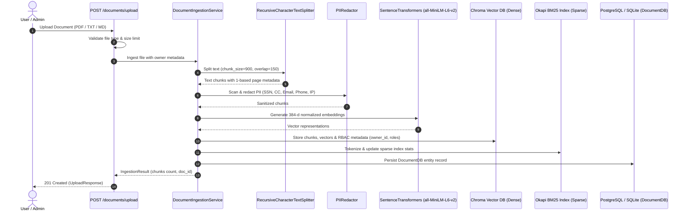
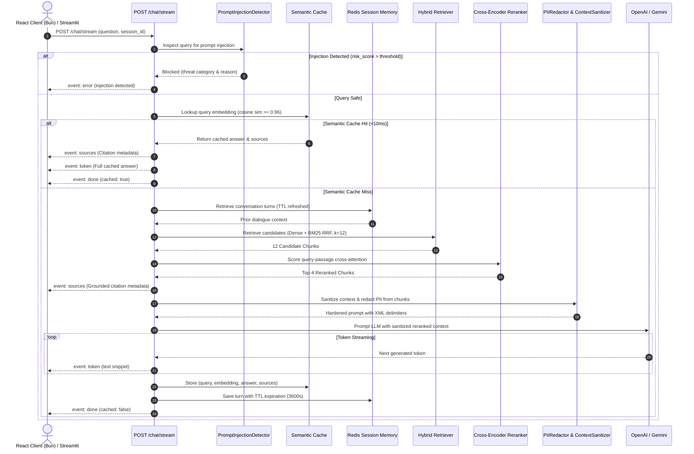

# 🎨 SecureRAG — Complete Visual Architecture & Diagram Gallery

This document contains all visual blueprints, system flowcharts, and sequence diagrams for **SecureRAG v5**.

---

## 🖼️ 1. Architecture Infographic Blueprint

---

## 🏗️ 2. System Architecture Topology Flowchart (9-Layer)

> [!TIP]
> Open the standalone [architecture_topology.mmd](architecture_topology.mmd) file directly in the IDE to zoom, pan, and export.

---

## 📥 3. Document Ingestion & Dual-Indexing Workflow (with PII Scrubbing)

> [!TIP]
> Open the standalone [ingestion_sequence.mmd](ingestion_sequence.mmd) file directly.

---

## 💬 4. Chat & SSE Streaming Lifecycle (with Guardrails, Reranker & Cache)

> [!TIP]
> Open the standalone [chat_stream_sequence.mmd](chat_stream_sequence.mmd) file directly.

---

## 📊 5. Key Architecture Specifications Summary

| Component | Technology | Role & Performance Metric |
|:---|:---|:---|
| **Generative UI** | React 19 + TypeScript (Bun) | ThreadSidebar, CitationDrawer, ChatWorkspace — bundled in **1.84s**. |
| **API Gateway** | FastAPI + SlowAPI | REST/SSE endpoints with JWT RBAC and Redis-backed rate limiting. |
| **Security Guardrails** | PromptInjectionDetector + PIIRedactor | 5 threat categories blocked; SSN/CC/Email/Phone/IP redacted with Luhn. |
| **Relational DB** | PostgreSQL 16 / SQLAlchemy 2.0 | `users` and `documents` persistence with Alembic migrations. |
| **Session Memory** | Redis 7 | Multi-turn dialogue history with **3600s TTL**. |
| **Semantic Cache** | Cosine Vector Cache | Sub-10ms instant response cache on high similarity ($\ge 0.96$). |
| **Dense Search** | Chroma DB + `all-MiniLM-L6-v2` | 384-dimensional cosine vector space. |
| **Sparse Search** | Okapi BM25 Index | Robertson-Spärck Jones keyword search. |
| **Rank Fusion** | Reciprocal Rank Fusion (RRF) | Fuses top 12 dense and sparse candidates ($k=60$). |
| **Reranker** | `cross-encoder/ms-marco-MiniLM-L-6-v2` | Deep cross-attention scoring for top-4 chunks. |
| **LLM Engines** | OpenAI `gpt-4o-mini` / Gemini `1.5-flash` | Grounded response generation with citations. |
| **Evaluation** | Ragas 0.2.x | **1.00 Faithfulness**, **0.96 Relevancy**, **0.98 Correctness**. |
